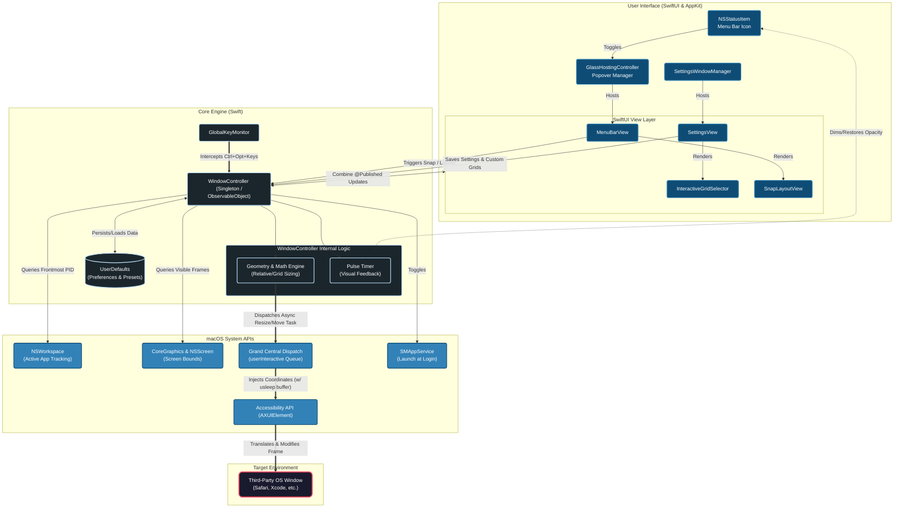

```mermaid
graph TD
    %% Define Styles
    classDef ui fill:#0f4c75,stroke:#3282b8,stroke-width:2px,color:#fff,rx:5px,ry:5px;
    classDef core fill:#1b262c,stroke:#bbe1fa,stroke-width:2px,color:#fff,rx:5px,ry:5px;
    classDef sys fill:#3282b8,stroke:#0f4c75,stroke-width:2px,color:#fff,rx:5px,ry:5px;
    classDef target fill:#1a1a2e,stroke:#e94560,stroke-width:3px,color:#fff,rx:10px,ry:10px;

    subgraph UI ["User Interface (SwiftUI & AppKit)"]
        MB["NSStatusItem <br/> Menu Bar Icon"]
        PO["GlassHostingController <br/> Popover Manager"]
        SW["SettingsWindowManager"]
        
        subgraph Views ["SwiftUI View Layer"]
            MenuBarView["MenuBarView"]
            SettingsView["SettingsView"]
            Grid["InteractiveGridSelector"]
            Snap["SnapLayoutView"]
        end
        
        MB -->|Toggles| PO
        PO -->|Hosts| MenuBarView
        SW -->|Hosts| SettingsView
        MenuBarView -->|Renders| Snap
        SettingsView -->|Renders| Grid
    end

    subgraph Core ["Core Engine (Swift)"]
        WC["WindowController <br/> (Singleton / ObservableObject)"]
        GKM["GlobalKeyMonitor"]
        
        subgraph WC_Logic ["WindowController Internal Logic"]
            Layout["Geometry & Math Engine <br/> (Relative/Grid Sizing)"]
            Pulse["Pulse Timer <br/> (Visual Feedback)"]
        end
        
        UD[("UserDefaults <br/> (Preferences & Presets)")]
    end

    subgraph MacOS ["macOS System APIs"]
        AX["Accessibility API (AXUIElement)"]
        WS["NSWorkspace <br/> (Active App Tracking)"]
        CG["CoreGraphics & NSScreen <br/> (Screen Bounds)"]
        GCD["Grand Central Dispatch <br/> (userInteractive Queue)"]
        SM["SMAppService <br/> (Launch at Login)"]
    end

    subgraph Target ["Target Environment"]
        TA["Third-Party OS Window <br/> (Safari, Xcode, etc.)"]
    end

    %% UI to Core Connections
    MenuBarView -->|Triggers Snap / Layout| WC
    SettingsView -->|Saves Settings & Custom Grids| WC
    WC <-->|Combine @Published Updates| Views
    WC <-->|Persists/Loads Data| UD
    WC -->|Toggles| SM
    
    %% Core Internals
    GKM == "Intercepts Ctrl+Opt+Keys" ==> WC
    WC --> Layout
    WC --> Pulse
    Pulse -.->|Dims/Restores Opacity| MB
    
    %% Core to OS API Connections
    WC -->|Queries Frontmost PID| WS
    WC -->|Queries Visible Frames| CG
    
    Layout == "Dispatches Async Resize/Move Task" ==> GCD
    GCD == "Injects Coordinates (w/ usleep buffer)" ==> AX
    
    %% Execution
    AX == "Translates & Modifies Frame" ==> TA

    %% Assign Classes
    class MB,PO,SW,MenuBarView,SettingsView,Grid,Snap ui;
    class WC,GKM,Layout,Pulse,UD,WC_Logic core;
    class AX,WS,CG,GCD,SM sys;
    class TA target;
```
