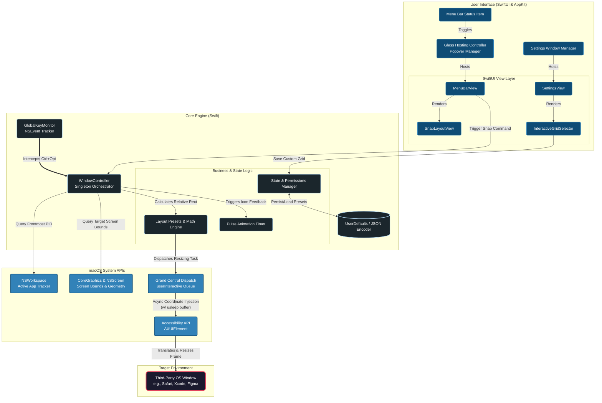

```mermaid
graph TD
    %% Define Styles
    classDef ui fill:#0f4c75,stroke:#3282b8,stroke-width:2px,color:#fff,rx:5px,ry:5px;
    classDef core fill:#1b262c,stroke:#bbe1fa,stroke-width:2px,color:#fff,rx:5px,ry:5px;
    classDef sys fill:#3282b8,stroke:#0f4c75,stroke-width:2px,color:#fff,rx:5px,ry:5px;
    classDef target fill:#1a1a2e,stroke:#e94560,stroke-width:3px,color:#fff,rx:10px,ry:10px;

    subgraph UI ["User Interface (SwiftUI & AppKit)"]
        MB[Menu Bar Status Item]
        PO[Glass Hosting Controller <br/> Popover Manager]
        SW[Settings Window Manager]
        
        subgraph Views ["SwiftUI View Layer"]
            MenuBarView[MenuBarView]
            SettingsView[SettingsView]
            Grid[InteractiveGridSelector]
            Snap[SnapLayoutView]
        end
        
        MB -->|Toggles| PO
        PO -->|Hosts| MenuBarView
        SW -->|Hosts| SettingsView
        MenuBarView -->|Renders| Snap
        SettingsView -->|Renders| Grid
    end

    subgraph Core ["Core Engine (Swift)"]
        WC[WindowController <br/> Singleton Orchestrator]
        GKM[GlobalKeyMonitor <br/> NSEvent Tracker]
        
        subgraph Logic ["Business & State Logic"]
            Layout[Layout Presets & Math Engine]
            State[State & Permissions Manager]
            Pulse[Pulse Animation Timer]
        end
        
        UD[(UserDefaults / JSON Encoder)]
    end

    subgraph MacOS ["macOS System APIs"]
        AX[Accessibility API <br/> AXUIElement]
        WS[NSWorkspace <br/> Active App Tracker]
        CG[CoreGraphics & NSScreen <br/> Screen Bounds & Geometry]
        GCD[Grand Central Dispatch <br/> userInteractive Queue]
    end

    subgraph Target ["Target Environment"]
        TA[Third-Party OS Window <br/> e.g., Safari, Xcode, Figma]
    end

    %% Core Connections
    MenuBarView -->|Trigger Snap Command| WC
    Grid -->|Save Custom Grid| State
    State <-->|Persist/Load Presets| UD
    
    GKM == "Intercepts Ctrl+Opt" ==> WC
    WC -->|Calculates Relative Rect| Layout
    WC -->|Triggers Icon Feedback| Pulse
    
    %% OS API Connections
    WC -->|Query Frontmost PID| WS
    WC -->|Query Target Screen Bounds| CG
    
    Layout == "Dispatches Resizing Task" ==> GCD
    GCD == "Async Coordinate Injection <br/> (w/ usleep buffer)" ==> AX
    
    %% Execution
    AX == "Translates & Resizes Frame" ==> TA

    %% Assign Classes
    class MB,PO,SW,MenuBarView,SettingsView,Grid,Snap ui;
    class WC,GKM,Layout,State,Pulse,UD core;
    class AX,WS,CG,GCD sys;
    class TA target;
```
