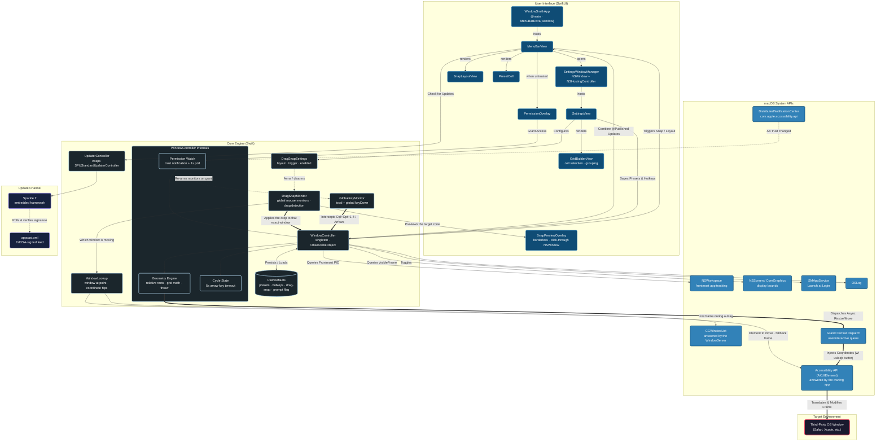

# WindowSmith Architecture

Reflects WindowSmith 1.1 (build 11).

## Notable Mechanisms

**Primary-display coordinate anchoring.** AppKit measures from the bottom-left of the primary display; the Accessibility API measures from the top-left. Every conversion is anchored to the display whose origin is `(0,0)` rather than `NSScreen.main`, which follows the key window and therefore reports a different — and differently sized — screen whenever the target window sits on a secondary monitor.

**Permission detection without polling the user.** A menu bar app never receives `didBecomeActive` when the user flips the Accessibility switch in System Settings, so trust changes arrive two ways: an observer on the `com.apple.accessibility.api` distributed notification, plus a 1-second timer that runs only while untrusted and invalidates itself on grant. The timer is scheduled in `.common` run loop mode so it keeps firing while the menu bar popover is open.

**Re-arming the key monitors.** Global `NSEvent` monitors installed before Accessibility is granted never receive `keyDown` and do not begin working retroactively, so the grant transition tears them down and reinstalls them.

**Modifier normalization.** Arrow keys set `.function` and `.numericPad` alongside the real modifiers, and caps lock can be latched, so all three are stripped before matching the `Ctrl+Opt` chord. Digits are read from `charactersIgnoringModifiers`, since Option remaps the printable character.

**Two disagreeing answers to "where is this window".** A title-bar drag is carried out by the WindowServer, not by the application — which is why a hung app's window can still be dragged. The Accessibility API asks the *owning application* for its position, so during a drag it returns a stale value and then jumps, measured at roughly 105ms behind the cursor across repeated drags. `CGWindowList` asks the WindowServer instead and tracks the cursor essentially 1:1. Drag detection therefore reads the WindowServer, which also cannot be stalled by an unresponsive app the way synchronous Accessibility IPC into that app's run loop can. The two sources are checked for agreement at mouse-down, and detection falls back to Accessibility if they disagree, so a mismatch can never move the wrong window.

**Distinguishing a window drag from a drag inside a window.** Nothing announces that a window drag has begun, so a candidate window is captured on mouse-down and promoted only once its frame actually moves while its size holds steady — a changed size means a resize handle, not a title bar. Cursor distance cannot make this call: the reported position lags far behind the pointer before catching up, so "the cursor moved but the window has not" describes an ordinary drag just as well as a text selection. Only elapsed time separates them, and nothing is drawn before the gesture is confirmed, so waiting costs a few extra probes and no visible latency.

**A preview that cannot swallow its own gesture.** The zone preview is a borderless, transparent `NSWindow` above the normal window level. It sits directly under the cursor for the entire drag, so it sets `ignoresMouseEvents` — without that it would consume the very drag it exists to illustrate.

**Asynchronous injection.** Sizing and positioning are dispatched on a background `userInteractive` queue with a short `usleep` buffer between the size and position writes, allowing the target application's UI thread to settle before the final coordinate snap.
