# WindowSmith Architecture

Reflects WindowSmith 1.3 (build 15).

```mermaid
graph TD
    %% Define Styles
    classDef ui fill:#0f4c75,stroke:#3282b8,stroke-width:2px,color:#fff,rx:5px,ry:5px;
    classDef core fill:#1b262c,stroke:#bbe1fa,stroke-width:2px,color:#fff,rx:5px,ry:5px;
    classDef sys fill:#3282b8,stroke:#0f4c75,stroke-width:2px,color:#fff,rx:5px,ry:5px;
    classDef net fill:#16213e,stroke:#9d8cff,stroke-width:2px,color:#fff,rx:5px,ry:5px;
    classDef target fill:#1a1a2e,stroke:#e94560,stroke-width:3px,color:#fff,rx:10px,ry:10px;

    subgraph UI ["User Interface (SwiftUI)"]
        App["WindowSmithApp<br/>@main · MenuBarExtra(.window)"]
        MenuBarView["MenuBarView"]
        Overlay["PermissionOverlay"]
        SWM["SettingsWindowManager<br/>NSWindow + NSHostingController"]
        SettingsView["SettingsView"]
        Snap["SnapLayoutView"]
        Cell["PresetCell"]
        Grid["GridBuilderView<br/>cell selection · grouping"]
        Preview["SnapPreviewOverlay<br/>borderless · click-through NSWindow"]
        Palette["ZoomPalettePanel<br/>non-activating NSPanel · rebuilt per open"]

        App -->|hosts| MenuBarView
        MenuBarView -->|when untrusted| Overlay
        MenuBarView -->|renders| Snap
        MenuBarView -->|renders| Cell
        MenuBarView -->|opens| SWM
        SWM -->|hosts| SettingsView
        SettingsView -->|renders| Grid
        Palette -->|renders| Snap
    end

    subgraph Core ["Core Engine (Swift)"]
        WC["WindowController<br/>singleton · ObservableObject"]
        GKM["GlobalKeyMonitor<br/>local + global keyDown"]
        UPD["UpdaterController<br/>wraps SPUStandardUpdaterController"]

        subgraph WC_Logic ["WindowController Internals"]
            Geo["Geometry Engine<br/>relative rects · throw"]
            Perm["Permission Watch<br/>trust notification + 1s poll"]
            Cycle["Cycle State<br/>5s arrow-key timeout"]
        end

        DSM["DragSnapMonitor<br/>global mouse monitors · drag detection"]
        DSS["DragSnapSettings<br/>layout · trigger · enabled"]
        WL["WindowLookup<br/>window at point · coordinate flips"]
        LM["Layout Model<br/>Preset.layout · GridMerges.blocks"]
        ZPM["ZoomPaletteMonitor<br/>pointer resting on a green button"]
        ZPS["ZoomPaletteSettings<br/>one switch · palette + Apple's menu"]

        UD[("UserDefaults<br/>presets · hotkeys · drag-snap · green button · prompt flag")]
    end

    subgraph MacOS ["macOS System APIs"]
        AX["Accessibility API (AXUIElement)<br/>answered by the owning app"]
        CGW["CGWindowList<br/>answered by the WindowServer"]
        WS["NSWorkspace<br/>frontmost app · wake"]
        CG["NSScreen / CoreGraphics<br/>display bounds"]
        GCD["Grand Central Dispatch<br/>userInteractive queue"]
        SM["SMAppService<br/>Launch at Login"]
        DNC["DistributedNotificationCenter<br/>com.apple.accessibility.api"]
        OSL["OSLog"]
        GP["Global preferences<br/>NSZoomButtonShowMenu"]
    end

    subgraph Updates ["Update Channel"]
        SPK["Sparkle 2<br/>embedded framework"]
        Feed["appcast.xml<br/>EdDSA-signed feed"]
    end

    subgraph Target ["Target Environment"]
        TA["Third-Party OS Window<br/>(Safari, Xcode, etc.)"]
    end

    %% UI to Core
    MenuBarView -->|Triggers Snap / Layout| WC
    SettingsView -->|Saves Presets & Hotkeys| WC
    Overlay -->|Grant Access| Perm
    MenuBarView -->|Check for Updates| UPD
    WC <-->|Combine @Published Updates| MenuBarView
    WC <-->|Persists / Loads| UD
    WC -->|Toggles| SM

    %% Core internals
    GKM == "Intercepts Ctrl+Opt+1-4 / Arrows" ==> WC
    WC --> Geo
    WC --> Cycle
    WC --> Perm
    WC --> OSL
    DNC -.->|AX trust changed| Perm
    Perm -.->|Re-arms monitors on grant| GKM

    %% Core to OS
    WC -->|Queries Frontmost PID| WS
    WC -->|Queries visibleFrame| CG
    Geo == "Dispatches Async Resize/Move" ==> GCD
    GCD == "Injects Coordinates (w/ usleep buffer)" ==> AX
    AX == "Translates & Modifies Frame" ==> TA

    %% Drag to snap
    SettingsView -->|Configures| DSS
    DSS -.->|Arms / disarms| DSM
    DSM -->|Which window is moving| WL
    WL -->|Live frame during a drag · window under the pointer| CGW
    WL -->|Element to move · green button · fallback frame| AX
    DSM -->|Previews the target zone| Preview
    DSM == "Applies the drop to that exact window" ==> WC
    WS -.->|Wake · display change: rebuild| Preview

    %% One zone decomposition for every consumer
    WC -->|resolveLayout| LM
    Cell -->|preset.layout| LM
    SettingsView -->|preset.layout| LM
    Grid -->|Draws the same blocks| LM

    %% Green-button palette
    SettingsView -->|Asks, then configures| ZPS
    ZPS -.->|Arms / disarms| ZPM
    ZPS -->|Hides / restores Apple's menu| GP
    ZPM -->|Window and button under the pointer| WL
    ZPM -->|Opens beside the button| Palette
    ZPM == "Places that exact window" ==> WC

    %% Updates
    UPD --> SPK
    SPK -.->|Polls & verifies signature| Feed

    %% Assign Classes
    class App,MenuBarView,Overlay,SWM,SettingsView,Snap,Cell,Grid,Preview,Palette ui;
    class WC,GKM,UPD,Geo,Perm,Cycle,UD,WC_Logic,DSM,DSS,WL,LM,ZPM,ZPS core;
    class AX,WS,CG,GCD,SM,DNC,OSL,CGW,GP sys;
    class SPK,Feed net;
    class TA target;
```

## Notable Mechanisms

**Primary-display coordinate anchoring.** AppKit measures from the bottom-left of the primary display; the Accessibility API measures from the top-left. Every conversion is anchored to the display whose origin is `(0,0)` rather than `NSScreen.main`, which follows the key window and therefore reports a different — and differently sized — screen whenever the target window sits on a secondary monitor.

**Permission detection without polling the user.** A menu bar app never receives `didBecomeActive` when the user flips the Accessibility switch in System Settings, so trust changes arrive two ways: an observer on the `com.apple.accessibility.api` distributed notification, plus a 1-second timer that runs only while untrusted and invalidates itself on grant. The timer is scheduled in `.common` run loop mode so it keeps firing while the menu bar popover is open.

**Re-arming the key monitors.** Global `NSEvent` monitors installed before Accessibility is granted never receive `keyDown` and do not begin working retroactively, so the grant transition tears them down and reinstalls them.

**Modifier normalization.** Arrow keys set `.function` and `.numericPad` alongside the real modifiers, and caps lock can be latched, so all three are stripped before matching the `Ctrl+Opt` chord. Digits are read from `charactersIgnoringModifiers`, since Option remaps the printable character.

**Two disagreeing answers to "where is this window".** A title-bar drag is carried out by the WindowServer, not by the application — which is why a hung app's window can still be dragged. The Accessibility API asks the *owning application* for its position, so during a drag it returns a stale value and then jumps, measured at roughly 105ms behind the cursor across repeated drags. `CGWindowList` asks the WindowServer instead and tracks the cursor essentially 1:1. Drag detection therefore reads the WindowServer, which also cannot be stalled by an unresponsive app the way synchronous Accessibility IPC into that app's run loop can. The two sources are checked for agreement at mouse-down, and detection falls back to Accessibility if they disagree, so a mismatch can never move the wrong window.

**Distinguishing a window drag from a drag inside a window.** Nothing announces that a window drag has begun, so a candidate window is captured on mouse-down and promoted only once its frame actually moves while its size holds steady — a changed size means a resize handle, not a title bar. Cursor distance cannot make this call: the reported position lags far behind the pointer before catching up, so "the cursor moved but the window has not" describes an ordinary drag just as well as a text selection. Only elapsed time separates them, and nothing is drawn before the gesture is confirmed, so waiting costs a few extra probes and no visible latency.

**A preview that cannot swallow its own gesture.** The zone preview is a borderless, transparent `NSWindow` above the normal window level. It sits directly under the cursor for the entire drag, so it sets `ignoresMouseEvents` — without that it would consume the very drag it exists to illustrate.

**A preview that survives a long sleep.** The preview window is created once and reused, and it joins every Space. After a long lid-closed sleep the Mac wakes from Deep Idle, treats the display as new hardware and rebuilds its Spaces, and a hidden window can come out of that belonging to none: ordering it front then reports success and shows nothing, indefinitely. So a hidden preview window is discarded on wake and on any display change, and every time it is shown it is asked whether it actually landed on the active Space; if not, it is replaced on the spot.

**One zone decomposition.** A saved grid is rows, columns and an optional list of grouped blocks. `Preset.layout` is the only place that turns that into zones, and it does so through `GridMerges.blocks` - the same function the Custom Grid Builder draws from. The hotkey, the arrow-key cycle, drag-to-snap, both miniatures and the builder therefore cannot disagree about a layout's shape: there is one answer, not four copies of the arithmetic. Zones come out in row-major order with each group at its top-left cell, and that order is what the arrow keys walk.

**Groups stay on the grid.** A group is stored as integer grid coordinates, never as a fraction of the screen, so every edge it has is a k/rows or k/cols line - the same lines the ungrouped cells sit on. Built-in layouts follow the same rule: Bias is exactly two thirds rather than 0.66, which had left a 23px strip between a Bias window and a Thirds window on an ultrawide. Stored groups are clamped to the grid before use, since shrinking the builder under a group would otherwise leave a hole in the layout - and a hole shows up only as drag-to-snap declining to preview over it.

**Finding the green button without watching every window.** The palette opens when the pointer rests on another app's green button, so it watches mouse movement - the one feature that does - and the checks run from cheap to costly. The WindowServer names the single window under the pointer, which measured about three times faster than copying the full window list and, unlike the list, does not grow with the number of windows open. Only when the pointer is in that window's top-left corner, the 100×70pt where traffic lights can sit under a tall unified toolbar, is the app itself asked through Accessibility what is there; a green button reports the subrole `AXFullScreenButton`, or `AXZoomButton` in a window that can only zoom. That query is capped at a 0.1s timeout and at most one every 60ms. Throttling must not drop the moment of arrival, though: a resting pointer sends no more events, so a movement that lands inside the 60ms window schedules one look at wherever the pointer ends up, and a corner with no answer is retried every 0.1s for up to a second. Nothing runs while the pointer is still, and nothing at all while the feature is off.

**A palette that does not take focus.** The palette is a non-activating `NSPanel`, so choosing a zone leaves the app being arranged in front with its keyboard focus, and its hosting view accepts the first click, since a panel that never becomes key would otherwise spend that click on focusing itself. The chosen zone is applied to the window whose button was hovered, not to whatever is frontmost, which is what lets it arrange a background window. And for the same reason the drag preview needs rebuilding after a long sleep, the panel is not reused at all: it is built on every open and discarded on close.

**Replacing Apple's menu.** Apple's green-button menu is controlled by one system-wide preference, `NSZoomButtonShowMenu` in the global domain. The palette's switch owns it: on writes `false`, off removes it, so the palette and Apple's menu are never both switched on or both off. Because that reaches every app on the Mac, turning the switch on asks first, and the preference is written only when the switch is flipped, never at launch. Apps read it only when they start, so windows already open keep Apple's menu until their app is reopened.

**Asynchronous injection.** Sizing and positioning are dispatched on a background `userInteractive` queue with a short `usleep` buffer between the size and position writes, allowing the target application's UI thread to settle before the final coordinate snap.
